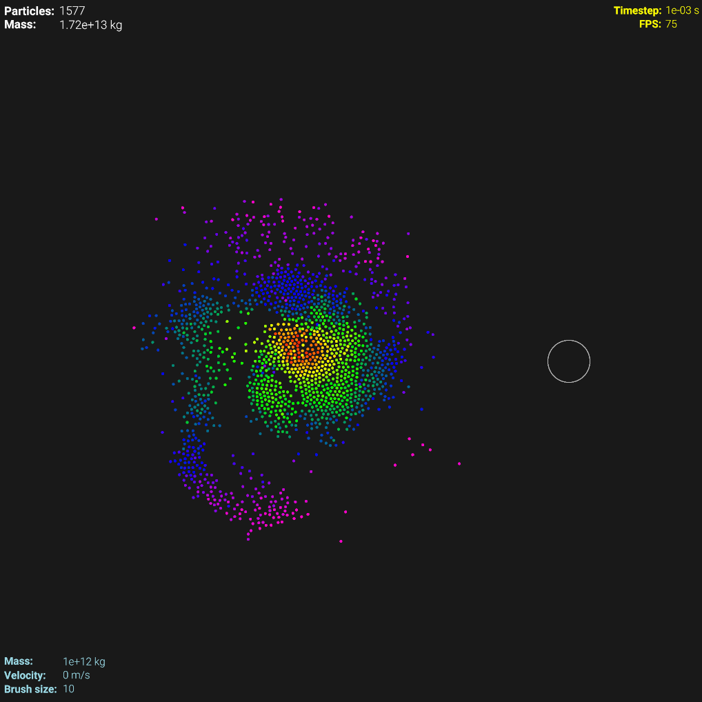

# Particle Simulator

A particle simulator written in C++ using **GLFW**, **GLEW**, and **GLM**.

---

## Preview

Screenshot:

Demo:

---

## Controls

- **Mouse Controls**:

  - `Left mouse click`: Add particles
  - `Right mouse click`: Remove particles
  - `Ctrl + left mouse click`: Add single particle
  - `Mouse wheel down`: Decrease brush size
  - `Mouse wheel up`: Increase brush size

- **Keyboard Controls**:

  - `[` : Decrease brush size
  - `]` : Increase brush size
  - `F` : Pause and frame step forward
  - `R` : Remove all particles
  - `S` : Decrease particle velocity
  - `W` : Increase particle velocity
  - `Space` : Pause/Resume simulation
  - `Comma (,)` : Slow down time
  - `Period (.)` : Speed up time

- **Mass Exponent Controls**:

  - `0-9` : Mass exponent (10^0 - 10^9)
  - `Ctrl + 0-9` : Mass exponent (10^10 - 10^19)
  - `Numpad 0-9` : Mass exponent (10^20 - 10^29)
  - `Ctrl + Numpad 0-9` : Mass exponent (10^30 - 10^39)

- **Other Controls**:
  - `F1` : Toggle UI
  - `ESC` : Exit program

---

## License

This project is licensed under the MIT License. Feel free to use, modify, and distribute it as needed.
